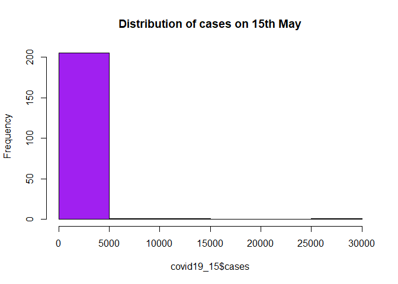
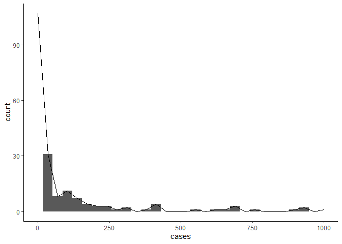
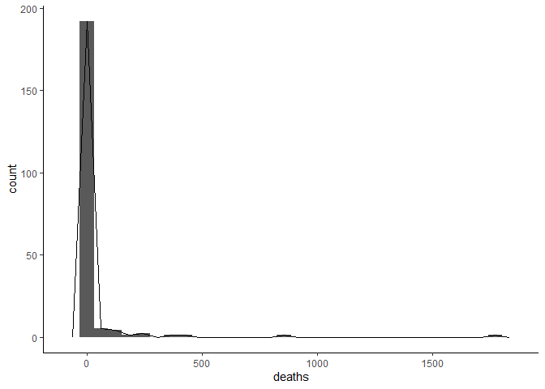
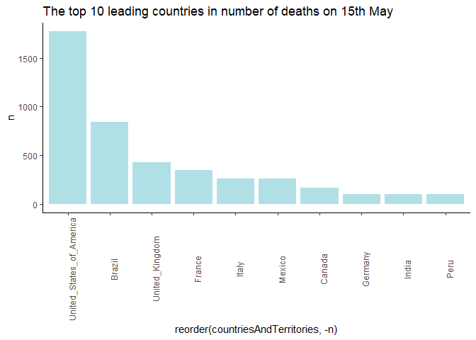
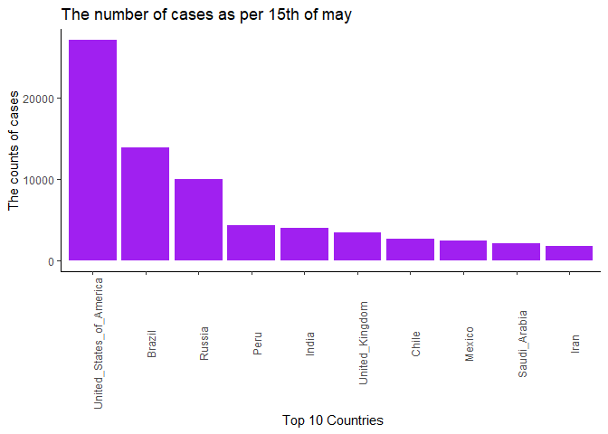
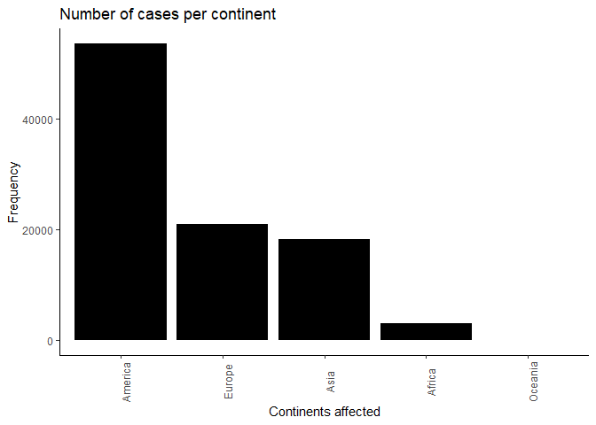
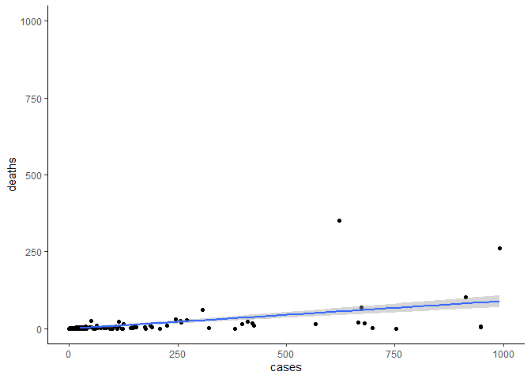
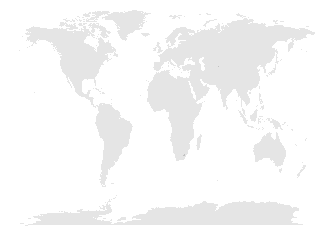

Untitled
================
Purity
15/05/2020

## R Markdown

This is an R Markdown document. Markdown is a simple formatting syntax
for authoring HTML, PDF, and MS Word documents. For more details on
using R Markdown see <http://rmarkdown.rstudio.com>.

When you click the **Knit** button a document will be generated that
includes both content as well as the output of any embedded R code
chunks within the document. You can embed an R code chunk like this:

``` r
library(readxl)
covid19 <- read_excel("covid19.xlsx")
View(covid19)
```

## Including Plots

You can also embed plots, for example:

    ##                 dateRep                     day                   month 
    ##                       0                       0                       0 
    ##                    year                   cases                  deaths 
    ##                       0                       0                       0 
    ## countriesAndTerritories                   geoId    countryterritoryCode 
    ##                       0                       0                       0 
    ##             popData2018            continentExp 
    ##                       0                       0

    ## [1] 0

    ## # A tibble: 6 x 11
    ##   dateRep               day month  year cases deaths countriesAndTer~ geoId
    ##   <dttm>              <dbl> <dbl> <dbl> <dbl>  <dbl> <chr>            <chr>
    ## 1 2020-05-15 00:00:00    15     5  2020   113      6 Afghanistan      AF   
    ## 2 2020-05-14 00:00:00    14     5  2020   259      3 Afghanistan      AF   
    ## 3 2020-05-13 00:00:00    13     5  2020   280      5 Afghanistan      AF   
    ## 4 2020-05-12 00:00:00    12     5  2020   285      2 Afghanistan      AF   
    ## 5 2020-05-11 00:00:00    11     5  2020   369      5 Afghanistan      AF   
    ## 6 2020-05-10 00:00:00    10     5  2020   255      6 Afghanistan      AF   
    ## # ... with 3 more variables: countryterritoryCode <chr>,
    ## #   popData2018 <chr>, continentExp <chr>

Note that the `echo = FALSE` parameter was added to the code chunk to
prevent printing of the R code that generated the plot.

``` r
str(covid19)
```

    ## Classes 'tbl_df', 'tbl' and 'data.frame':    17158 obs. of  11 variables:
    ##  $ dateRep                : POSIXct, format: "2020-05-15" "2020-05-14" ...
    ##  $ day                    : num  15 14 13 12 11 10 9 8 7 6 ...
    ##  $ month                  : num  5 5 5 5 5 5 5 5 5 5 ...
    ##  $ year                   : num  2020 2020 2020 2020 2020 2020 2020 2020 2020 2020 ...
    ##  $ cases                  : num  113 259 280 285 369 255 215 171 168 330 ...
    ##  $ deaths                 : num  6 3 5 2 5 6 3 2 9 5 ...
    ##  $ countriesAndTerritories: chr  "Afghanistan" "Afghanistan" "Afghanistan" "Afghanistan" ...
    ##  $ geoId                  : chr  "AF" "AF" "AF" "AF" ...
    ##  $ countryterritoryCode   : chr  "AFG" "AFG" "AFG" "AFG" ...
    ##  $ popData2018            : chr  "37172386" "37172386" "37172386" "37172386" ...
    ##  $ continentExp           : chr  "Asia" "Asia" "Asia" "Asia" ...

``` r
summary(covid19)
```

    ##     dateRep                         day            month     
    ##  Min.   :2019-12-31 00:00:00   Min.   : 1.00   Min.   : 1.0  
    ##  1st Qu.:2020-03-04 00:00:00   1st Qu.: 8.00   1st Qu.: 3.0  
    ##  Median :2020-04-04 00:00:00   Median :15.00   Median : 4.0  
    ##  Mean   :2020-03-26 11:12:14   Mean   :15.21   Mean   : 3.4  
    ##  3rd Qu.:2020-04-25 00:00:00   3rd Qu.:23.00   3rd Qu.: 4.0  
    ##  Max.   :2020-05-15 00:00:00   Max.   :31.00   Max.   :12.0  
    ##       year          cases             deaths       
    ##  Min.   :2019   Min.   :-2461.0   Min.   :  -6.00  
    ##  1st Qu.:2020   1st Qu.:    0.0   1st Qu.:   0.00  
    ##  Median :2020   Median :    2.0   Median :   0.00  
    ##  Mean   :2020   Mean   :  256.8   Mean   :  17.61  
    ##  3rd Qu.:2020   3rd Qu.:   37.0   3rd Qu.:   1.00  
    ##  Max.   :2020   Max.   :48529.0   Max.   :4928.00  
    ##  countriesAndTerritories    geoId           countryterritoryCode
    ##  Length:17158            Length:17158       Length:17158        
    ##  Class :character        Class :character   Class :character    
    ##  Mode  :character        Mode  :character   Mode  :character    
    ##                                                                 
    ##                                                                 
    ##                                                                 
    ##  popData2018        continentExp      
    ##  Length:17158       Length:17158      
    ##  Class :character   Class :character  
    ##  Mode  :character   Mode  :character  
    ##                                       
    ##                                       
    ## 

\#i want to check only for 15th may

``` r
library(tidyverse)
```

    ## Warning: package 'tidyverse' was built under R version 3.6.3

    ## -- Attaching packages ---------------------- tidyverse 1.3.0 --

    ## v ggplot2 3.2.1     v purrr   0.3.4
    ## v tibble  2.1.3     v dplyr   0.8.3
    ## v tidyr   1.0.0     v stringr 1.4.0
    ## v readr   1.3.1     v forcats 0.4.0

    ## Warning: package 'readr' was built under R version 3.6.3

    ## Warning: package 'purrr' was built under R version 3.6.3

    ## -- Conflicts ------------------------- tidyverse_conflicts() --
    ## x dplyr::filter() masks stats::filter()
    ## x dplyr::lag()    masks stats::lag()

``` r
covid19_15<-covid19%>%
  filter(day == 15,month == 5)
```

``` r
head(covid19_15)
```

    ## # A tibble: 6 x 11
    ##   dateRep               day month  year cases deaths countriesAndTer~ geoId
    ##   <dttm>              <dbl> <dbl> <dbl> <dbl>  <dbl> <chr>            <chr>
    ## 1 2020-05-15 00:00:00    15     5  2020   113      6 Afghanistan      AF   
    ## 2 2020-05-15 00:00:00    15     5  2020    18      0 Albania          AL   
    ## 3 2020-05-15 00:00:00    15     5  2020   189      7 Algeria          DZ   
    ## 4 2020-05-15 00:00:00    15     5  2020     1      0 Andorra          AD   
    ## 5 2020-05-15 00:00:00    15     5  2020     3      0 Angola           AO   
    ## 6 2020-05-15 00:00:00    15     5  2020     0      0 Anguilla         AI   
    ## # ... with 3 more variables: countryterritoryCode <chr>,
    ## #   popData2018 <chr>, continentExp <chr>

``` r
dim(covid19_15)
```

    ## [1] 208  11

``` r
colSums(is.na(covid19_15))
```

    ##                 dateRep                     day                   month 
    ##                       0                       0                       0 
    ##                    year                   cases                  deaths 
    ##                       0                       0                       0 
    ## countriesAndTerritories                   geoId    countryterritoryCode 
    ##                       0                       0                       0 
    ##             popData2018            continentExp 
    ##                       0                       0

\#check on the str more

``` r
glimpse(covid19_15)
```

    ## Observations: 208
    ## Variables: 11
    ## $ dateRep                 <dttm> 2020-05-15, 2020-05-15, 2020-05-15, 2...
    ## $ day                     <dbl> 15, 15, 15, 15, 15, 15, 15, 15, 15, 15...
    ## $ month                   <dbl> 5, 5, 5, 5, 5, 5, 5, 5, 5, 5, 5, 5, 5,...
    ## $ year                    <dbl> 2020, 2020, 2020, 2020, 2020, 2020, 20...
    ## $ cases                   <dbl> 113, 18, 189, 1, 3, 0, 0, 255, 142, 0,...
    ## $ deaths                  <dbl> 6, 0, 7, 0, 0, 0, 0, 24, 1, 0, 0, 2, 0...
    ## $ countriesAndTerritories <chr> "Afghanistan", "Albania", "Algeria", "...
    ## $ geoId                   <chr> "AF", "AL", "DZ", "AD", "AO", "AI", "A...
    ## $ countryterritoryCode    <chr> "AFG", "ALB", "DZA", "AND", "AGO", "NA...
    ## $ popData2018             <chr> "37172386", "2866376", "42228429", "77...
    ## $ continentExp            <chr> "Asia", "Europe", "Africa", "Europe", ...

\#some data won’t be needed for this analysis like geoid and countrycode

``` r
covid19_15$popData2018<-parse_integer(covid19_15$popData2018)
```

``` r
covid19_15<-select(covid19_15,-c(geoId ,countryterritoryCode ))
```

``` r
head(covid19_15)
```

    ## # A tibble: 6 x 9
    ##   dateRep               day month  year cases deaths countriesAndTer~
    ##   <dttm>              <dbl> <dbl> <dbl> <dbl>  <dbl> <chr>           
    ## 1 2020-05-15 00:00:00    15     5  2020   113      6 Afghanistan     
    ## 2 2020-05-15 00:00:00    15     5  2020    18      0 Albania         
    ## 3 2020-05-15 00:00:00    15     5  2020   189      7 Algeria         
    ## 4 2020-05-15 00:00:00    15     5  2020     1      0 Andorra         
    ## 5 2020-05-15 00:00:00    15     5  2020     3      0 Angola          
    ## 6 2020-05-15 00:00:00    15     5  2020     0      0 Anguilla        
    ## # ... with 2 more variables: popData2018 <int>, continentExp <chr>

``` r
ggplot(covid19_15,aes(y = cases,x = popData2018,na.rm =T))+
  geom_jitter()+
  geom_smooth(method = "lm")+
  theme_classic()
```

    ## Warning: Removed 5 rows containing non-finite values (stat_smooth).

    ## Warning: Removed 5 rows containing missing values (geom_point).

<!-- -->

``` r
#check distribution
library(ggplot2)
```

``` r
hist(
  covid19_15$cases,
  main = "Distribution of cases on 15th May",
  col = "purple",
  
)
```

<!-- -->

``` r
#use ggplot
ggplot(covid19_15,aes(cases))+
  geom_histogram()+
  geom_freqpoly()+
  xlim(0,1000)+
  theme_classic()
```

    ## `stat_bin()` using `bins = 30`. Pick better value with `binwidth`.

    ## Warning: Removed 15 rows containing non-finite values (stat_bin).

    ## `stat_bin()` using `bins = 30`. Pick better value with `binwidth`.

    ## Warning: Removed 15 rows containing non-finite values (stat_bin).

    ## Warning: Removed 2 rows containing missing values (geom_bar).

    ## Warning: Removed 2 rows containing missing values (geom_path).

<!-- --> \#lets check on
deaths

``` r
ggplot(covid19_15,aes(deaths))+
  geom_histogram()+
  geom_freqpoly()+
  theme_classic()
```

    ## `stat_bin()` using `bins = 30`. Pick better value with `binwidth`.
    ## `stat_bin()` using `bins = 30`. Pick better value with `binwidth`.

<!-- -->

``` r
covid19_15$countriesAndTerritories<-as.factor(covid19_15$countriesAndTerritories)
str(covid19_15$countriesAndTerritories)
```

    ##  Factor w/ 208 levels "Afghanistan",..: 1 2 3 4 5 6 7 8 9 10 ...

``` r
covid19_15r<-covid19_15%>%
  count(countriesAndTerritories,wt = deaths,sort = T)%>%
  top_n(10)
```

    ## Selecting by n

``` r
  ggplot(covid19_15r,mapping = aes(x = reorder(countriesAndTerritories,-n),y = n))+
  geom_col(fill = "powder blue")+
    ggtitle("The top 10 leading countries in number of deaths on 15th May")+
    theme_classic()+
    theme(axis.text.x=element_text(angle = 90))
```

<!-- --> \#U.S.A is the
one leading in the number of deaths \#the above are the top ten leading
countries in death

``` r
covid19_15%>%
  count(countriesAndTerritories,wt = cases,sort = T)%>%
  top_n(10)%>%
  ggplot(covid19_15,mapping = aes(x = reorder(countriesAndTerritories,-n),y = n))+
  geom_col(fill = "purple")+
  ggtitle("The number of cases as per 15th of may")+
  xlab(" Top 10 Countries")+
  ylab("The counts of cases")+
  theme_classic()+
  theme(axis.text.x=element_text(angle = 90))
```

    ## Selecting by n

<!-- --> \#U.S.A is
still leading in number of cases and its almost evident that contries in
the top ten in deaths are almost the same in the top ten cases. \#though
some countries have huge cases but less to no deaths.

``` r
#check the continents affected
library(RColorBrewer)
covid19_15%>%
  count(continentExp,wt = cases,sort = T)%>%
  ggplot(covid19_15,mapping = aes(x =reorder(continentExp,-n) ,y = n))+
  geom_bar(stat = "identity",fill = "black")+
  ggtitle("Number of cases per continent")+
  xlab("Continents affected")+
  ylab("Frequency")+
  theme_classic()+
  theme(axis.text.x=element_text(angle = 90))
```

<!-- -->

``` r
#lets plot cases against deaths and see their relationship
ggplot(data = covid19_15,aes(x = cases,y = deaths))+
  geom_point()+
  geom_smooth(method = "lm")+
  xlim(0,1000)+
  ylim(0,1000)+
  theme_classic()
```

    ## Warning: Removed 15 rows containing non-finite values (stat_smooth).

    ## Warning: Removed 15 rows containing missing values (geom_point).

    ## Warning: Removed 2 rows containing missing values (geom_smooth).

<!-- -->

\#as we can see they are linear coorelated \#a slight increase in number
of covid 19 cases also increases number of

```` 


```r
library(maps)
````

    ## Warning: package 'maps' was built under R version 3.6.3

    ## 
    ## Attaching package: 'maps'

    ## The following object is masked from 'package:purrr':
    ## 
    ##     map

``` r
library(MAP)
```

    ## Warning: package 'MAP' was built under R version 3.6.3

    ## Loading required package: flexmix

    ## Warning: package 'flexmix' was built under R version 3.6.3

    ## Loading required package: lattice

    ## Warning: package 'lattice' was built under R version 3.6.3

    ## Loading required package: Matrix

    ## 
    ## Attaching package: 'Matrix'

    ## The following objects are masked from 'package:tidyr':
    ## 
    ##     expand, pack, unpack

``` r
world = map_data("world")
covid19_15%>%
  group_by(countriesAndTerritories)%>%
  filter(cases>0)%>%
  ggplot(covid19_15,mapping = aes(NULL,NULL,)) +
  geom_map(
    data = world, map = world,
    aes(long, lat, map_id = region),
     fill = "gray50", size = 0.05, alpha = 0.2
  ) +
  theme_void(base_family = "IBMPlexSans") +
  labs(x = NULL, y = NULL, color = NULL)
```

    ## Warning: Ignoring unknown aesthetics: x, y

<!-- -->
